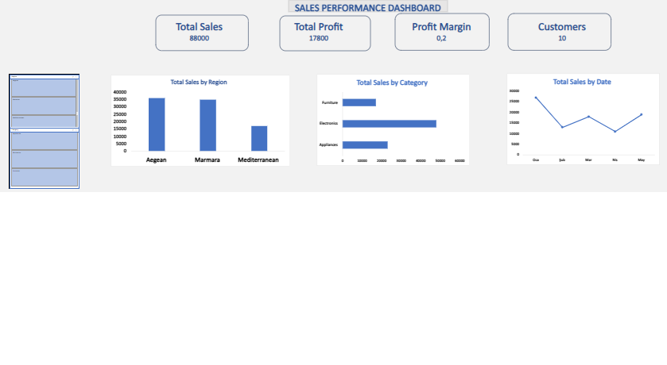
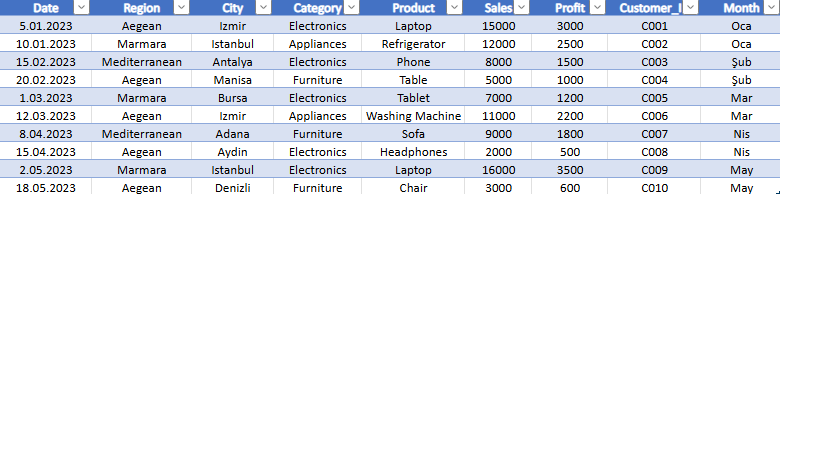

### Excel  Sales Performance Dashboard 

# Proje  Hakkında 

Bu proje, Microsoft Excel kullanılarak geliştirilmiş interaktif bir **Satış Performans Dashboard** çalışmasıdır.  

Dashboard, satış verilerini analiz ederek bölgesel performans, kategori dağılımı ve zaman bazlı trendleri incelemeyi amaçlamaktadır.  

Veri analizi, KPI takibi ve görselleştirme becerilerini göstermek amacıyla hazırlanmıştır.

##  Dashboard Görünümü

---

##  Veri Seti

# Kullanılan veri seti aşağıdaki alanları içermektedir:

- Tarih (Date)  
- Bölge (Region)  
- Şehir (City)  
- Kategori (Category)  
- Ürün (Product)  
- Satış (Sales)  
- Kâr (Profit)  
- Müşteri ID (Customer ID)

  
 ### Dashboard Özellikleri

- Toplam Satış (Total Sales)  
- Toplam Kâr (Total Profit)  
- Kâr Marjı (Profit Margin)  
- Toplam Müşteri Sayısı  

- Bölge bazlı satış analizi  
- Kategori bazlı dağılım  
- Aylık satış trendi  

- Slicer ile dinamik filtreleme  

### Kullanılan Formüller

# Toplam Satış: =SUM(SalesData[Sales])

# Toplam kar : =SUM(SalesData[Profit])

# Müşteri sayısı: =COUNTA(SalesData[Customer_ID])

# Kar marjı: =SUM(SalesData[Profit]) / SUM(SalesData[Sales])

##  Elde Edilen İçgörüler

- Ege ve Marmara bölgeleri satışta öne çıkmaktadır  
- Elektronik kategorisi en yüksek geliri sağlamaktadır  
- Satışlar aylara göre değişkenlik göstermektedir  
- Kâr marjı genel olarak dengelidir  

---

##  Kullanılan Araçlar

- Microsoft Excel  
- Pivot Table  
- Grafikler (Bar, Line, Pie)  
- Slicer  
- Veri Analizi  

 ### Projenin Amacı

## Bu proje ile:

- Excel ile veri analizi  
- Dashboard geliştirme  
- KPI oluşturma  
- Veri görselleştirme  

becerilerinin gösterilmesi amaçlanmıştır.

###   Excel Sales Performance Dashboard

##  Project Overview

This project is an interactive Sales Performance Dashboard developed using Microsoft Excel.

It analyzes sales data to provide insights into regional performance, category distribution, and time-based trends.

---

##  Dashboard

---

##  Dataset

The dataset includes:

- Date  
- Region  
- City  
- Category  
- Product  
- Sales  
- Profit  
- Customer ID  

---

##  Features

- Total Sales  
- Total Profit  
- Profit Margin  
- Total Customers  

- Sales by Region  
- Sales by Category  
- Monthly Sales Trend  

- Interactive filtering with slicers  

---

## Key Formulas

Total Sales: =SUM(SalesData[Sales])  

Total Profit: =SUM(SalesData[Profit])  

Customer Count: =COUNTA(SalesData[Customer_ID])  

Profit Margin: =SUM(SalesData[Profit]) / SUM(SalesData[Sales])  

---

##  Key Insights

- Aegean and Marmara regions have the highest sales  
- Electronics category generates the most revenue  
- Sales vary across months  
- Profit margin is relatively stable  

---

##  Tools Used

- Microsoft Excel  
- Pivot Tables  
- Charts  
- Slicers  
- Data Analysis  

---

##  Purpose

This project demonstrates:

- Data analysis skills  
- Excel dashboard development  
- KPI tracking  
- Data storytelling  
